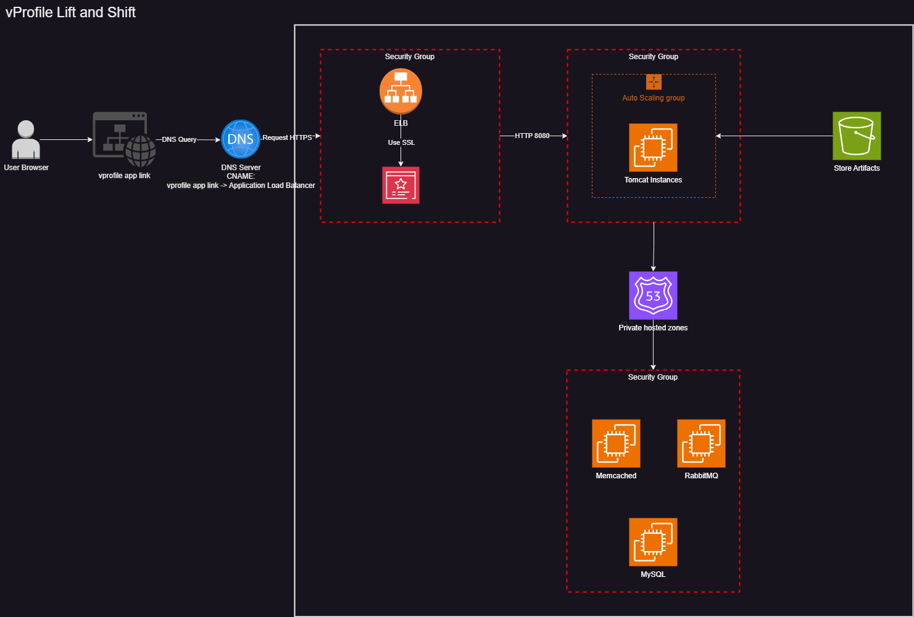

# vProfile Lift and Shift Project

This project is a Terraform configuration for deploying a multi-tier application on AWS. The application consists of a frontend, application servers, and backend services including a database, Memcached, and RabbitMQ.


## Diagram



## Architecture

The architecture consists of the following components:
- **VPC**: A Virtual Private Cloud to host all resources.
- **Security Groups**: To control inbound and outbound traffic to instances.
- **EC2 Instances**: For the database, Memcached, RabbitMQ, and application servers.
- **IAM Role**: For accessing S3 buckets.
- **Load Balancer**: An Application Load Balancer (ALB) to distribute traffic.
- **Auto Scaling Group**: To manage the scaling of application servers.

## Components

1. **VPC**: A default VPC is used.
2. **Security Groups**:
   - `vprofile-ELB-SG`: For the Load Balancer.
   - `vprofile-app-sg`: For the application servers.
   - `vprofile-backend-sg`: For the backend services (database, Memcached, RabbitMQ).
3. **EC2 Instances**:
   - `vprofile-db-01`: MySQL database server.
   - `vprofile-mc-01`: Memcached server.
   - `vprofile-rmq-01`: RabbitMQ server.
   - `vprofile-app-01`: Application server running Tomcat.
4. **Load Balancer**:
   - An Application Load Balancer (ALB) to distribute incoming traffic to the application servers.
5. **Auto Scaling Group**:
   - Manages the scaling of application servers based on demand.

## Prerequisites

- Terraform installed on your local machine.
- AWS CLI configured with appropriate permissions.
- An existing key pair in AWS for SSH access to instances.

## Usage

1. Clone the repository:
   ```sh
   git clone https://github.com/mark-john-ignacio/vprofile-lift-and-shift.git
   cd vprofile-lift-and-shift
   ```

2. Initialize Terraform:
   ```sh
   terraform init
   ```

3. Apply the Terraform configuration:
   ```sh
   terraform apply
   ```

4. Confirm the apply action with `yes`.

## Cleanup

To destroy the infrastructure created by this Terraform configuration, run:
```sh
terraform destroy
```

